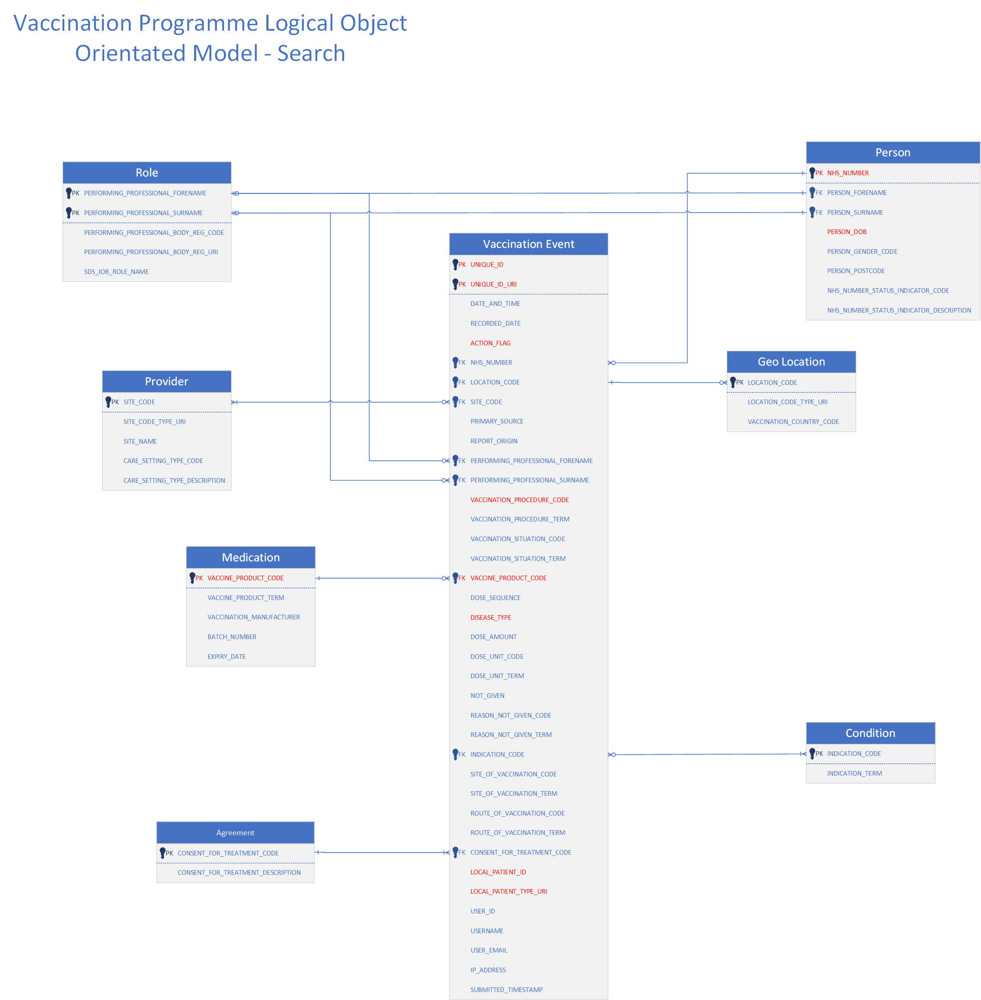

# Devtools - Localstack

## About 
LocalStack is a fully functional local cloud service emulator that allows developers to run AWS services locally without connecting to the actual AWS cloud. It is especially useful for testing, development, and CI/CD pipelines where real AWS resources are not needed or too costly.

## Setup:
1. Install aws cli & awslocal (for localstack) for local testing of the infrastructure, might need to install unzip. AWSLocal is a wrapper for aws that simplifies interaction with LocalStack.
    ```
    curl "https://awscli.amazonaws.com/awscli-exe-linux-x86_64.zip" -o "awscliv2.zip"
    unzip awscliv2.zip
    sudo ./aws/install

    pip install awscli-local
    ```
2. Install terraform by following the instructions from `https://developer.hashicorp.com/terraform/tutorials/aws-get-started/install-cli`

3. Navigate to `devtools`. 
4. Create a virtual environment in devtools: `python -m venv .venv`.
5. Activate virtual environment: `source .venv/bin/activate`. You should see a `(.venv)` as a prefix in your terminal.
6. Upgrade pip in the new environment: `pip install --upgrade pip`.
7. Run `pip install -r requirements.txt` to install packages.
8. Run `make localstack` to setup localstack to run in docker.
9. Run `make init` or `terraform init`. If you get an error about failing to install providers, then remove the `.terraform.lock.hcl` and try again.
10. Run `make seed` to create a dynamodb table in localstack and add some data into it.
11. Run the following command to get a list of 10 items from dynamodb from localstack: 
    ```
    awslocal dynamodb query \
        --table-name imms-default-imms-events \
        --key-condition-expression "PK = :pk" \
        --expression-attribute-values '{":pk": {"S": "Immunization#e3e70682-c209-4cac-629f-6fbed82c07cd"}}'.
    ```
12. If you want to delete the table run `terraform apply -destroy`

## Interacting with localstack
The idea with localstack in regards to our project is to have a dynamodb table or an s3 bucket to interact with. We can't setup all the infrastructure on localstack because of the high complexity and lack of certain features such as AWS networking and IAM enforcement.

1. Check if localstack is running in docker by calling: `docker ps`. The output should display a running container with the image localstack/localstack
2. Ensure that you have a dynamodb table set up and some data inside the table provided by the `make seed` command.
3. You can install dynamodb-admin which is npm web app that connects to localstack, to set it up: 
    ```
    npm install -g dynamodb-admin

    export DYNAMO_ENDPOINT=http://localhost:4566
    export AWS_REGION=us-east-1

    dynamodb-admin

    # Navigate to the url provided, typically: http://localhost:8001/ where you should see the table imms-default-imms-events
    ```

4. To interact with the code there are 2 options. You can either persist the application lambda via docker or you can directly run / debug the code directly in vscode. Please note some modifications are needed to configure the code to run successfuly. 

    4.1 To run it via vs code, we can try the get_imms_handler, but first we should ensure that the request is correct so ensure that `event` has the folowing details. Note: that we are trying to retrieve the following immunisation record form the sample data `e3e70682-c209-4cac-629f-6fbed82c07cd` hence why we hardcoded the `VaccineTypePermissions`.

    ```
    event = {
            "pathParameters": {"id": args.id},
            "headers": {
                "Content-Type": "application/x-www-form-urlencoded",
                "AuthenticationType": "ApplicationRestricted",
                "Permissions": (",".join([Permission.READ])),
                "VaccineTypePermissions": "covidcode2:read"
            },
        }
    ```
    4.2 If you want to run it via docker make the following changes in the lambda.Dockerfile:
    - Set the dynamo db table name env variable to `imms-default-imms-events` 
    - Add `ENV DYNAMODB_TABLE_NAME=imms-default-imms-events` into the base section of the file
    - Add the following line at the end in the lambda.Dockerfile:  `CMD ["get_status_handler.get_status_handler"]`
    - Test by sending a request via Postman to `http://localhost:8080/2015-03-31/functions/function/invocations` and add the event data into the body section.


## Access Pattern

We receive Immunisation Events in json format via our API. Each message contains inlined resources i.e. it doesn't
contain a reference/link to a preexisting resource. For example, a vaccination event contains the full patient resource
embedded in it. This means our backend doesn't assume Patient as a separate resource but rather, part of the message
itself. This is the same for other resources included in the resource like address, location etc.

* **Creating an event:** Add the entire message in an attribute so, it can be retrieved. This attribute has the entire
  original message with no changes. The event-id must be contained in the message itself. Our backend won't create the
  id. **This is our main index.** and it doesn't contain any sort-key
* **Retrieve an event:** The simplest form is by id; `GET /event/{id}`. This access pattern should always result in
  either one resource or none
* **Search:** This pattern can be broken down into two main categories. Queries that retrieve events with a known
  patient and, queries that retrieve events with particular set of search criteria.

### Patient

One index is dedicated to search patient. This will satisfy
the `/event?NhsNumber=1234567,dateOfBirth=01/01/1970,diseaseTypeFilter=covid|flu|mmr|hpv|polio` endpoint.
The `NhsNumber` is our PK and the SK has `<dateOfBirth>#<diseaseType>#<eventId>` format. **This means, in order to
filter based on `diseaseType`, `dateOfBirth` must be known. We can filter based on only `nhsNumber` and `diseaseType`
but that requires an attribute filter.

**Q:** Do we need to retrieve events based on only NHS number and Disease Type? i.e. is this a valid
request? `GET /event?NhsNumber=1234567,diseaseTypeFilter=covid`
**Q:** What is LocalPatient? In our sample data we have both ID and System values, but we don't have any access pattern
for it.

### Vaccination

The provided object relational model, has a few highlighted fields related to vaccination but, we don't have any search
criteria for them. We can create one or more indices to address different search requests but, we need to know in
advance what they are.

For example, one access pattern can be `PK: DiseaseType` and `SK: <vacc_procedure>#<vacc_product>#<event_id>`. This will
be similar to the patient access pattern.

**Q:** What are search criteria for vaccination related fields?

## Field mappings

Given the relational model (below image) and `sample_event.json` below is our field mappings for highlighted fields:


* `UNIQUE_ID -> $["identifier"][0]["value"]`
* `UNIQUE_ID_URI -> $["identifier"][0]["system"]`
* `ACTION_FLAG -> ?????`
* `VACCINATION_PROCEDURE_CODE -> $["extension"][0]["valueCodeableConcept"]["coding"][0]["code"]`
* `VACCINATION_PRODUCT_CODE -> $["vaccineCode"]["coding"][0]["code"]`
* `DISEASE_TYPE -> $["protocolApplied"][0]["targetDisease"][0]["coding"][0]["code"]`
* `LOCAL_PATIENT_ID -> $["contained"][0]["item"][3]["answer"][0]["valueCoding"]["code"]`
* `LOCAL_PATIENT_TYPE_URI -> $["contained"][0]["item"][3]["answer"][0]["valueCoding"]["system"]`

TODO: write the rest of the mappings.

**Q**: What does this
mean: [[first point in Overview]](https://nhsd-confluence.digital.nhs.uk/display/Vacc/Immunisation+FHIR+API+-+IEDS+Data+Model)
> This data model must include backwards compatibility with the legacy CSV process to account for business continuity

## Error Scenarios

We assume all error responses will be of type `OperationOutcome`. We can break down scenarios in three categories. One
group is errors that are generated and dealt with in the Proxy before reaching to our backend.
Authentication/authorisation errors belong to this group.

A second group is related to both fine and coarse validation errors.

* **Q:** What is expected in the response message? A detailed diagnostics of the validation or just a generic error?

The third group is anything related to the backend itself. `404` and, catch-all exceptions in the source code (like
malformed json for example)
